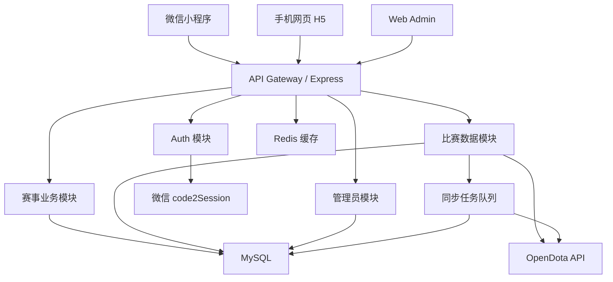
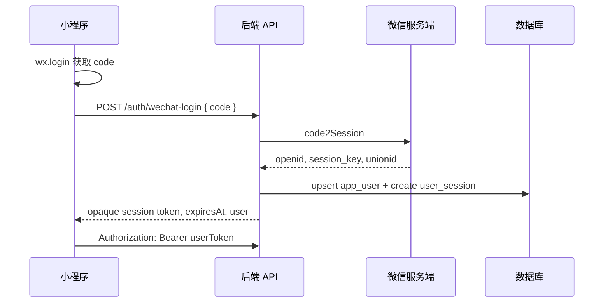
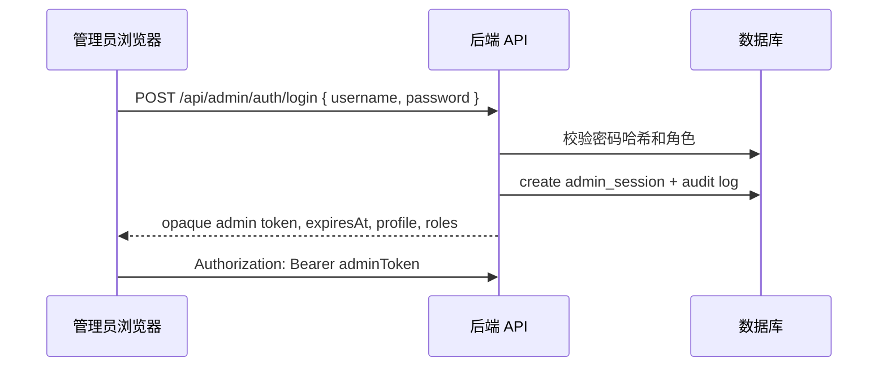

# 技术方案

最后更新：2026-05-13

## 1. 技术选型

### 1.1 小程序前端

建议使用：

- 小程序框架：Taro + React + TypeScript
- UI 基础：TDesign Mini Program 或 NutUI for Taro
- 状态管理：Zustand 或 Taro 内置状态加 React Query 思路
- 图表：ECharts 微信小程序版
- 构建目标：微信小程序，专注用户侧展示

原因：

- 现有网页端是 React 技术栈，Taro 能复用 React 组件组织思路。
- 比赛详情页复杂，TypeScript 能降低字段映射错误。
- ECharts 更适合经济曲线、经验曲线、横向对比条。

### 1.2 Web Admin 前端

建议使用：

- 框架：React + TypeScript + Vite
- UI 基础：Ant Design
- 数据请求：TanStack Query + Axios
- 路由：React Router
- 表单：Ant Design Form，复杂场景可补充 React Hook Form

原因：

- 管理端以表格、筛选、表单、批量操作为主，Ant Design 的效率高。
- 管理端运行在电脑浏览器，适合承载赛程、队伍、选手、赛果、同步任务等复杂操作。
- 可以复用现有网页端项目的 React 经验，但不强行复用用户侧 UI。

### 1.3 手机网页 H5 前端

建议使用：

- 框架：React + TypeScript + Vite
- UI 基础：轻量移动端组件或 NutUI React
- 数据请求：TanStack Query + Axios
- 图表：ECharts
- 部署目标：Nginx 静态站点

原因：

- H5 是小程序上线延迟时的用户侧兜底入口，需要能独立部署和快速发布。
- H5 更适合作为比赛详情外链和分享落地页。
- 与 Web Admin 同为 React + Vite，可以共享构建工具；与小程序共享接口类型和展示逻辑。

### 1.4 后端

建议使用：

- Runtime：Node.js 22 LTS
- 框架：Express + TypeScript
- ORM：Sequelize
- 数据库：MySQL 8.0 或 MariaDB
- 缓存和队列：Redis + BullMQ，MVP 可先用数据库任务表
- 鉴权：微信登录 + 服务端自定义 token，管理员接口 RBAC

原因：

- 参考项目已经使用 Node.js + Express + Sequelize + MySQL，比赛、选手、成就、同步服务都能较平滑迁移。
- Sequelize 与现有表结构和迁移文件更接近。
- Redis 用于 token、同步队列、OpenDota 限流和热点详情缓存。

### 1.5 仓库结构

```text
mrjz-app/
  apps/
    miniprogram/          # Taro 微信小程序
    mobile-web/           # React 手机网页 H5
    admin/                # React Web Admin
    api/                  # Express API 服务
  packages/
    shared/               # 共享类型、常量、字段枚举
  database/
    migrations/
    seeds/
  docs/
  README.md
```

当前仓库先创建文档，代码骨架在开发第一阶段落地。

## 2. 总体架构



核心原则：

- 小程序和手机网页 H5 不直接请求 OpenDota，统一通过后端代理和缓存。
- Web Admin 是唯一推荐的数据维护入口，小程序和 H5 只展示公开数据、个人数据和必要互动。
- 后端保存原始 OpenDota JSON，结构化字段用于列表、详情和统计。
- 管理员维护赛程、联赛配置和异常纠偏；后端自动发现比赛、同步 OpenDota、请求解析并补全赛后详细数据。
- 用户个人数据按平台联赛范围聚合，禁止直接返回全局战绩。

## 3. OpenDota 集成

OpenDota 当前 OpenAPI 版本查询为 `31.1.0`。关键端点：

| 场景 | OpenDota 端点 | 说明 |
| --- | --- | --- |
| 获取比赛详情 | `GET /matches/{match_id}` | 核心详情数据 |
| 请求解析比赛 | `POST /request/{match_id}` | 解析请求计入更高 rate cost |
| 查询解析任务 | `GET /request/{jobId}` | 查看解析状态 |
| 联赛比赛 ID | `GET /leagues/{league_id}/matchIds` | 包含业余联赛，优先使用 |
| 联赛比赛数据 | `GET /leagues/{league_id}/matches` | OpenAPI 标注不含业余联赛，谨慎使用 |
| 英雄常量 | `GET /constants/{resource}` | heroes、items、abilities 等 |
| 英雄统计 | `GET /heroStats` | 可做补充，不作为 MVP 核心 |

### 3.1 自动同步策略

1. 管理员按赛季配置 `league_id`、同步频率、是否自动请求解析。
2. `league-discovery` 定时任务优先调用 `/leagues/{league_id}/matchIds`，发现联赛下的 match_id。
3. 后端对新 match_id 创建同步任务，逐个调用 `/matches/{match_id}`。
4. 后端保存 `raw_match_json` 和结构化字段，并尝试自动关联 `series_games`。
5. 如果 `version`、`objectives`、`picks_bans`、`players.gold_t` 等高级字段缺失，则标记 `parse_status = not_parsed`。
6. 如果该联赛开启自动解析，`parse-request` 任务按限流策略调用 `POST /request/{match_id}`。
7. `parse-polling` 定时任务轮询 `/matches/{match_id}` 或 `/request/{jobId}`，解析完成后刷新结构化数据。
8. `series_games` 结果确认后触发 `TournamentService` 重算阶段积分、瑞士轮排名或淘汰赛晋级。
9. 管理员可以手动重试失败任务、请求解析、重新关联赛程或处理赛果冲突。
10. 所有 OpenDota 响应写入 `raw_match_json`，避免字段遗漏导致返工。

### 3.2 限流和缓存

- 普通详情读取优先读本地数据库。
- 外部请求必须经过队列，避免并发打爆 OpenDota。
- 同步任务默认串行或小并发，失败指数退避。
- 对常量资源做长缓存，英雄和物品版本变更时手动刷新。

### 3.3 自动化任务

| 任务 | 触发方式 | 说明 |
| --- | --- | --- |
| `league-discovery` | 定时 + 手动 | 根据 league_id 拉取 match_id 列表，发现新比赛 |
| `match-sync` | 队列 + 手动 | 拉取单场比赛详情并写入结构化数据 |
| `parse-request` | 队列 + 手动 | 对未解析比赛请求 OpenDota 解析 |
| `parse-polling` | 定时 | 刷新解析中的比赛，补全高级数据 |
| `schedule-linker` | 同步后触发 + 手动 | 尝试把 OpenDota match 与 Web Admin 赛程关联 |
| `standings-recalc` | 赛果确认后触发 + 手动 | 重算小组赛和瑞士轮积分榜 |
| `bracket-advance` | 淘汰赛赛果确认后触发 + 手动 | 推进淘汰赛胜者到下一节点 |
| `sync-health-check` | 定时 | 发现长期失败或卡住的同步任务并告警 |

自动关联策略：

- match_id 明确填写时，优先使用 match_id 关联。
- 未填写 match_id 时，可按比赛时间窗口、双方队伍、联赛 ID 和 BO 顺序进行候选匹配。
- 匹配置信度不足时进入 Web Admin “待确认”列表，不自动覆盖人工赛程。
- OpenDota 结果与人工赛果冲突时进入“结果冲突”，前端公开展示以管理员确认结果为准。

## 4. 登录与权限

### 4.1 小程序登录



小程序登录只代表平台普通用户，不要求该用户已经参赛。登录用户可以继续浏览公开赛事、提交选手标签、点赞标签，并可在“我的”页绑定 Dota account_id 或 SteamID64。

### 4.2 Web Admin 登录

MVP 使用管理员账号密码登录。初始超级管理员只通过服务端 bootstrap 创建：当 `admin_users` 为空时，API 启动时读取 `ADMIN_INITIAL_USERNAME`、`ADMIN_INITIAL_PASSWORD` 和 `ADMIN_INITIAL_DISPLAY_NAME` 创建第一个 `super_admin`；生产环境必须显式配置 `ADMIN_INITIAL_PASSWORD`，不能使用默认开发密码。后续可增加微信扫码登录、邮箱验证码或二次验证。



安全要求：

- `session_key` 只保存在服务端，不返回给小程序。
- 小程序 token 和 Admin token 都使用服务端可撤销 opaque session token，生产环境不能直接使用 `user.id` 作为 token。
- 管理员角色存数据库，接口层统一校验，不能依赖前端隐藏菜单；公开 GET 白名单外的后台读写接口都必须校验 Admin token。
- Web Admin token 与小程序 token 分开管理，便于设置更短有效期和更严格权限。
- 绑定 Dota 账号允许先建立 `active + unverified` 关系，不要求该账号已有比赛记录；后续可通过审核、绑定码或白名单把 `verification_status` 提升为 `verified`，防止冒领选手身份。

### 4.3 H5 登录策略

H5 第一版不把登录作为上线阻塞项，优先提供公开展示和分享。后续需要互动能力时可选择：

- 微信网页授权：适合在微信内打开，依赖公众号网页授权能力。
- 手机号验证码：适合浏览器通用登录，但需要短信服务和风控。
- 一次性口令：适合小规模社区赛，由管理员给选手发放绑定码。

在 H5 登录未完成前，添加标签、点赞、我的数据等需要登录的能力优先引导用户打开小程序。

角色枚举：

- `guest`
- `user`
- `player`
- `team_admin`
- `tournament_admin`
- `super_admin`

## 5. 数据模型

### 5.1 用户与权限

| 表 | 关键字段 |
| --- | --- |
| `app_users` | id, open_id, union_id, nickname, role, created_at, updated_at |
| `user_sessions` | id, user_id, token_hash, expires_at, revoked_at, last_seen_at |
| `user_dota_accounts` | id, user_id, player_id, dota_account_id, steam_id64, binding_status, verification_status |
| `players` | id, account_id, steam_id64, display_name, current_team_id, avatar_url |
| `admin_users` | id, username, password_hash, display_name, status, created_at, updated_at |
| `admin_sessions` | id, admin_user_id, token_hash, expires_at, revoked_at, last_seen_at |
| `admin_roles` | admin_user_id, role, scope_type, scope_id |
| `admin_audit_logs` | actor_admin_id, action, resource_type, resource_id, detail_json, created_at |

`players.account_id` 是 Dota 玩家身份的归并主键。用户绑定一个尚未参赛的账号时，后端会创建空 player 档案；未来 OpenDota 同步命中同一个 `account_id` 时复用该 player，并补齐昵称、SteamID64、队伍和比赛统计。

### 5.2 赛事域

| 表 | 关键字段 |
| --- | --- |
| `seasons` | id, name, edition_number, start_date, end_date, is_active |
| `leagues` | id, season_id, opendota_league_id, name, status |
| `tournaments` | id, season_id, league_id, name, slug, status, current_stage_id, visibility, starts_at, ends_at |
| `tournament_stages` | id, tournament_id, type, name, sort_order, status, config_json, starts_at, ends_at, published_at |
| `stage_teams` | id, stage_id, team_id, seed, source_stage_id, source_rank, status |
| `stage_groups` | id, stage_id, name, sort_order, advance_count |
| `stage_group_teams` | id, group_id, stage_team_id, seed |
| `stage_rounds` | id, stage_id, group_id, round_number, name, status, pairing_status, published_at |
| `stage_standings` | id, stage_id, group_id, team_id, rank, points, series_wins, series_draws, series_losses, game_wins, game_losses, opponent_score, head_to_head_score, manual_rank, tiebreaker_json |
| `bracket_nodes` | id, stage_id, round_number, position, series_id, next_node_id, next_slot, team_a_id, team_b_id, winner_team_id, status |
| `teams` | id, season_id, name, short_name, logo_url, color |
| `team_members` | team_id, player_id, role, joined_at, left_at |
| `players` | id, dota_account_id, steam_id64, display_name, avatar_url |

说明：

- `tournament_stages.type` 取值为 `group`、`swiss`、`knockout`。
- `config_json` 保存阶段规则，例如积分规则、排名规则、瑞士轮总轮数、是否允许重复交手、淘汰赛规模、是否有三四名决赛。
- `stage_standings` 是后端重算后的当前排名快照，用户端直接读取，不在前端临时计算。
- `bracket_nodes` 表达淘汰赛节点；MVP 先支持单败淘汰，后续可扩展双败。

### 5.3 赛程和赛果

| 表 | 关键字段 |
| --- | --- |
| `series` | id, season_id, league_id, tournament_id, stage_id, round_id, group_id, bracket_node_id, radiant_team_id, dire_team_id, bo_type, scheduled_at, status, publish_status |
| `series_games` | id, series_id, game_index, match_id, radiant_score, dire_score, winner_team_id, manual_result_status |
| `schedule_notes` | series_id, note, visible_to_public, created_by |

说明：

- `series` 表达一轮 BO1、BO2、BO3。
- `series_games` 表达单局 Dota match。
- 人工赛果和 OpenDota 赛果都保留，冲突时显示“待管理员确认”。
- 小组赛、瑞士轮和淘汰赛都通过 `series.stage_id + series.round_id` 归入对应阶段。
- 对阵生成先写入 `publish_status=draft`，管理员确认后变为 `published`。

### 5.4 比赛数据

| 表 | 关键字段 |
| --- | --- |
| `matches` | match_id, league_id, series_game_id, start_time, duration, radiant_win, radiant_score, dire_score, game_mode, parse_status, raw_match_json |
| `match_players` | match_id, player_id, dota_account_id, hero_id, team, level, kills, deaths, assists, gpm, xpm, net_worth, last_hits, denies, hero_damage, tower_damage, hero_healing, damage_taken |
| `match_player_items` | match_id, player_id, slot_type, slot_index, item_id |
| `match_player_abilities` | match_id, player_id, ability_id, level, time |
| `match_drafts` | match_id, order, team, action, hero_id, player_id |
| `match_time_series` | match_id, player_id, metric, values_json |
| `match_objectives` | match_id, time, type, team, player_slot, key, raw_json |
| `match_chat` | match_id, time, team, player_id, message |

### 5.5 同步任务

| 表 | 关键字段 |
| --- | --- |
| `sync_jobs` | id, type, scope, status, progress_current, progress_total, error_message, retry_count, next_run_at, started_at, finished_at |
| `opendota_requests` | id, endpoint, params_json, status_code, cost, error_message, requested_at |
| `league_sync_configs` | id, season_id, league_id, enabled, interval_minutes, auto_request_parse, last_discovered_at, created_by |

### 5.6 社区互动标签

| 表 | 关键字段 |
| --- | --- |
| `tags` | id, tournament_id, target_type, target_id, normalized_text, display_text, created_by, like_count, status, review_reason, reviewed_by, reviewed_at, created_at, updated_at |
| `tag_likes` | tag_id, user_id, created_at |
| `tag_reports` | id, tag_id, reporter_user_id, reason, status, created_at, updated_at |
| `tag_audit_logs` | id, tag_id, actor, action, from_status, to_status, reason, created_at |

设计规则：

- 首个收束版本只开放选手标签，`target_type = player`；队伍标签保留为后续扩展。
- H5 只读展示 `approved` 选手标签，可播放本地应援反馈，但不调用真实点赞接口、不修改 `like_count`。
- 小程序登录用户可提交选手标签，提交后默认 `pending_review`，管理员通过后才公开展示。
- 小程序登录用户可点赞或取消点赞已审核通过的标签，点赞不需要审核。
- `normalized_text` 用于去重，建议统一 trim、全角半角归一、大小写归一。
- 选手标签按 `target_id + normalized_text` 跨届去重，`tournament_id` 只记录提交来源届次和支持后台筛选。
- Web Admin 标签管理以选手为工作对象，默认列出数据库全部选手，可按届次筛选，并在选中选手后读取其跨届全部标签和状态计数。
- Web Admin 可为了测试或运营纠偏直接新增选手标签，仍复用选手身份级去重和审计日志规则。
- Web Admin 可为了本地测试或运营纠偏直接增减 `like_count`，后端必须保证结果不小于 0，并写入标签审计日志。
- `status` 取值为 `pending_review`、`approved`、`rejected`、`hidden`。
- 拒绝、隐藏、恢复或通过标签时写入 `tag_audit_logs`。
- `like_count` 作为冗余计数字段，小程序点赞 / 取消点赞时事务更新。
- 标签展示大小由后端或前端根据 `like_count` 计算，建议限制在 12 到 28px。

## 6. API 设计

统一响应：

```json
{
  "success": true,
  "data": {},
  "pagination": {
    "page": 1,
    "pageSize": 20,
    "total": 100
  }
}
```

错误响应：

```json
{
  "success": false,
  "error": {
    "code": "FORBIDDEN",
    "message": "没有权限"
  }
}
```

### 6.1 认证

| 方法 | 路径 | 说明 |
| --- | --- | --- |
| POST | `/api/auth/wechat-login` | 微信 code 登录 |
| POST | `/api/auth/logout` | 退出登录 |
| GET | `/api/me` | 当前用户和账号绑定 |
| POST | `/api/me/player-binding` | 绑定 Dota account_id 或 SteamID64，可无比赛记录 |
| GET | `/api/me/stats` | 我的本联赛数据 |

### 6.2 Web Admin 认证

| 方法 | 路径 | 说明 |
| --- | --- | --- |
| POST | `/api/admin/auth/login` | 管理员账号密码登录 |
| POST | `/api/admin/auth/logout` | 管理员退出 |
| GET | `/api/admin/auth/me` | 当前管理员资料和权限 |
| PATCH | `/api/admin/auth/password` | 修改管理员密码 |

### 6.3 公开赛事

| 方法 | 路径 | 说明 |
| --- | --- | --- |
| GET | `/api/seasons` | 赛季列表 |
| GET | `/api/leagues` | 联赛列表 |
| GET | `/api/tournaments` | 赛事列表 |
| GET | `/api/tournaments/:id` | 赛事总览，包含当前阶段摘要 |
| GET | `/api/tournaments/:id/stages` | 赛事阶段列表 |
| GET | `/api/stages/:id/standings` | 小组赛或瑞士轮积分榜 |
| GET | `/api/stages/:id/rounds` | 阶段轮次和对阵 |
| GET | `/api/stages/:id/bracket` | 淘汰赛 bracket |
| GET | `/api/schedules` | 赛程列表 |
| GET | `/api/schedules/:id` | 赛程详情 |
| GET | `/api/matches` | 比赛记录列表 |
| GET | `/api/matches/:matchId` | 比赛详情 |
| GET | `/api/players` | 选手列表 |
| GET | `/api/players/:id` | 选手详情，限定联赛数据 |
| GET | `/api/tournaments/:id/players/:playerId` | 当前入口届次选手详情，包含跨届参赛历史 |
| GET | `/api/tournaments/:id/players/:playerId/tags` | 获取已审核通过的选手标签云 |
| POST | `/api/miniprogram/tournaments/:id/players/:playerId/tags` | 小程序登录用户提交选手标签，默认待审核 |
| POST | `/api/miniprogram/tags/:tagId/like` | 小程序登录用户点赞已通过标签 |
| DELETE | `/api/miniprogram/tags/:tagId/like` | 小程序登录用户取消点赞 |
| GET | `/api/teams` | 队伍列表 |
| GET | `/api/teams/:id` | 队伍详情 |

### 6.4 互动标签接口规则

添加标签请求：

```json
{
  "text": "绝活哥"
}
```

标签响应：

```json
{
  "id": 1,
  "targetType": "player",
  "targetId": 123,
  "text": "绝活哥",
  "likeCount": 18,
  "likedByMe": true,
  "sizeLevel": 4
}
```

规则：

- 只有小程序登录用户可以提交标签和真实点赞；H5 只能读取已通过审核的标签并播放本地应援反馈。
- 提交新标签需要管理员审核，点赞已有已通过标签不需要审核。
- 标签长度建议限制为 2 到 8 个中文字符或 2 到 16 个英文字符。
- 单用户对同一选手身份添加标签需要频控，例如每分钟最多 3 个、每天最多 30 个。
- 同一选手身份下重复标签不新建，直接返回已有标签及其审核状态。
- 同一 `tag_id + user_id` 只能点赞一次，取消点赞删除点赞记录。
- `sizeLevel` 可按点赞数分为 1 到 5 档，前端用档位控制字号和视觉权重。
- 被拒绝、隐藏或待审核标签不向普通用户展示。

### 6.5 管理端 API

| 方法 | 路径 | 说明 |
| --- | --- | --- |
| POST | `/api/admin/seasons` | 创建赛季 |
| PATCH | `/api/admin/seasons/:id` | 修改赛季 |
| POST | `/api/admin/tournaments` | 创建赛事 |
| PATCH | `/api/admin/tournaments/:id` | 修改赛事 |
| POST | `/api/admin/tournaments/:id/stages` | 创建赛事阶段 |
| PATCH | `/api/admin/stages/:id` | 修改阶段规则、状态和可见性 |
| POST | `/api/admin/stages/:id/teams` | 配置阶段参赛队 |
| POST | `/api/admin/stages/:id/generate-series` | 生成小组赛赛程草稿 |
| POST | `/api/stages/:id/swiss-pairings` | 生成或重生成瑞士轮指定轮次配对草稿 |
| POST | `/api/rounds/:id/confirm-swiss` | 确认瑞士轮配对并发布该轮 |
| POST | `/api/rounds/:id/retract-swiss` | 撤回该轮及后续瑞士轮配对 |
| POST | `/api/tournaments/:id/knockout-bracket` | 生成单败或双败淘汰赛 bracket 草稿 |
| PATCH | `/api/bracket-nodes/:id/slot` | 拖拽修正 bracket 节点队伍槽位 |
| POST | `/api/bracket-nodes/:id/winner` | 管理员确认 bracket 节点胜者并推进 |
| POST | `/api/admin/stages/:id/publish` | 发布阶段和草稿对阵 |
| POST | `/api/admin/stages/:id/recalculate-standings` | 重算阶段积分榜 |
| PATCH | `/api/admin/stage-standings/:id` | 手动修正排名或晋级标记 |
| PATCH | `/api/admin/bracket-nodes/:id` | 手动修正 bracket 节点或晋级结果 |
| POST | `/api/admin/teams` | 创建队伍 |
| PATCH | `/api/admin/teams/:id` | 修改队伍 |
| POST | `/api/admin/players` | 创建选手 |
| PATCH | `/api/admin/players/:id` | 修改选手 |
| POST | `/api/admin/schedules` | 创建赛程 |
| PATCH | `/api/admin/schedules/:id` | 修改赛程 |
| POST | `/api/admin/series-games/:id/result` | 录入单局结果 |
| POST | `/api/admin/matches/:matchId/sync` | 同步单场比赛 |
| POST | `/api/admin/leagues/:leagueId/sync` | 同步联赛比赛 |
| POST | `/api/admin/matches/:matchId/request-parse` | 请求 OpenDota 解析 |
| GET | `/api/admin/league-sync-configs` | 联赛自动同步配置列表 |
| POST | `/api/admin/league-sync-configs` | 创建联赛自动同步配置 |
| PATCH | `/api/admin/league-sync-configs/:id` | 修改同步频率、启停、自动解析策略 |
| POST | `/api/admin/sync-jobs/:id/retry` | 重试失败同步任务 |
| GET | `/api/admin/tags` | 标签列表与审核筛选 |
| GET | `/api/admin/tag-players` | 全部选手或按届次筛选的跨届标签工作台数据 |
| POST | `/api/admin/tournaments/:id/players/:playerId/tags` | 管理员为选手新增测试 / 纠偏标签 |
| PATCH | `/api/admin/tags/:tagId` | 隐藏、恢复或修改标签状态 |
| POST | `/api/admin/tags/:tagId/likes/adjust` | 管理员为测试或运营纠偏增减标签点赞数 |
| DELETE | `/api/admin/tags/:tagId` | 管理员删除测试或误建标签 |
| GET | `/api/admin/sync-jobs` | 同步任务列表 |
| GET | `/api/admin/audit-logs` | 审计日志 |

### 6.6 比赛管理服务

后端建议拆出 `TournamentService`，封装以下能力：

- `createStage`：创建小组赛、瑞士轮或淘汰赛阶段。
- `generateGroupSeriesDraft`：根据分组和循环规则生成小组赛 series 草稿。
- `generateSwissRoundDraft`：根据当前排名生成下一轮瑞士轮配对草稿。
- `generateKnockoutBracketDraft`：根据种子位生成单败淘汰 bracket 草稿。
- `publishDraftSeries`：发布草稿，对用户端可见。
- `recordSeriesResult`：汇总单局结果，确认 BO 胜方。
- `recalculateStandings`：重算小组赛或瑞士轮积分榜。
- `advanceBracketWinner`：淘汰赛节点完成后推进胜者。
- `lockStage`：锁定阶段结果，用于生成下一阶段参赛队。

服务边界：

- 赛事规则计算只在后端执行。
- 前端可请求生成草稿，但必须由管理员确认发布。
- OpenDota 同步只补全单局 match 数据；积分、晋级和排名以平台 series 结果为准。
- 任意自动计算结果被管理员覆盖时，必须写入 `admin_audit_logs`。

## 7. 比赛详情数据装配

后端推荐提供聚合接口 `GET /api/matches/:matchId`，避免小程序和 H5 多次请求。

返回结构：

```json
{
  "match": {},
  "series": {},
  "teams": {
    "radiant": {},
    "dire": {}
  },
  "players": {
    "radiant": [],
    "dire": []
  },
  "drafts": [],
  "charts": {
    "playerGold": [],
    "goldAdvantage": [],
    "xpAdvantage": []
  },
  "lanes": [],
  "comparisons": [],
  "chat": [],
  "parseStatus": "parsed"
}
```

字段降级：

- 没有 `picks_bans`：隐藏 Ban/Pick 或显示“待解析”。
- 没有 `gold_t`、`xp_t`：隐藏趋势图。
- 没有 `chat`：显示空状态。
- 没有队伍名：使用手动维护队伍名，或降级为 Radiant/Dire。

## 8. 从现有网页端复用的内容

可复用思路：

- `matches`、`players`、`match_players`、`heroes`、`achievements`、`sync_logs` 的基础模型。
- OpenDota match detail 字段适配逻辑。
- account_id 到 steam_id64 的转换逻辑。
- 英雄和物品资源映射。
- 成就检测逻辑，可作为后续增强模块。
- 比赛详情页的数据分组：双方队伍表、装备、加点、经济指标。

需要调整：

- 比赛列表和详情必须按小程序/H5 的移动端交互重做。
- 用户体系从网页匿名访问升级为小程序微信登录、Web Admin 管理员登录和 RBAC。
- 赛程和赛果从 OpenDota 数据外扩展为平台手动维护。
- OpenDota 联赛同步优先使用 `/leagues/{league_id}/matchIds`，以兼容业余联赛。

## 9. 部署方案

MVP 推荐：

- 云服务器：一台 2C4G 起步的 Linux 云服务器即可支撑 MVP，后续按访问量拆分。
- Nginx：负责 HTTPS、静态资源、API 反向代理。
- API：Node.js 服务部署在云服务器或容器中，域名需配置到微信小程序 request 合法域名。
- Web Admin：Vite 构建后作为静态站点部署到 Nginx，建议使用独立子域名。
- H5：Vite 构建后作为静态站点部署到 Nginx，用作公开展示和分享入口。
- DB：MySQL 8.0，MVP 可同机部署，正式期建议独立云数据库或至少每日备份。
- Redis：可选，若同步任务量不大可第二阶段加入；使用 BullMQ 时建议启用。
- 对象存储：队伍 Logo、静态图片、后续分享海报。
- 日志：文件日志 + 错误告警，后续接 Sentry 或类似服务。

域名建议：

```text
api.example.com      # 小程序、H5 和 Web Admin 共用 API
admin.example.com    # 管理后台
m.example.com        # 手机网页 H5
```

Nginx 路由建议：

```text
admin.example.com       -> apps/admin/dist
m.example.com           -> apps/mobile-web/dist
api.example.com/api/*   -> Node.js API
```

前端 API 地址切换约定：

- H5 读取 `PUBLIC_API_BASE_URL` 或 `VITE_PUBLIC_API_BASE_URL` 作为构建期 API 地址；开发时可用 `npm run dev:mobile-web:local` 或设置 `MRJZ_REMOTE_API_BASE_URL` 后运行 `npm run dev:mobile-web:remote`。
- H5 支持运行期临时覆盖：访问 `?apiBaseUrl=https://api.example.com/api` 会写入浏览器 localStorage，`?apiBaseUrl=local` 切回本地，`?apiBaseUrl=reset` 清除覆盖。
- 小程序读取 `MRJZ_MINIPROGRAM_API_BASE_URL` 作为构建期默认 API 地址，也兼容 `PUBLIC_API_BASE_URL` / `VITE_PUBLIC_API_BASE_URL`；开发者工具预览可用 `dev:miniprogram:local` 或设置 `MRJZ_REMOTE_API_BASE_URL` 后运行 `dev:miniprogram:remote`。
- 小程序“我的”页保留手动 API 地址覆盖，便于真机测试临时切换；上传正式版前必须使用已配置微信 request 合法域名的 HTTPS API。

服务器进程：

- `api`：Express API。
- `worker`：OpenDota 同步任务 worker，可与 API 同代码不同进程。
- `mysql`：MVP 可本机运行，需开启自动备份。
- `redis`：可选，启用队列时运行。

环境：

- `development`
- `staging`
- `production`

关键环境变量：

```text
NODE_ENV=
PORT=
MYSQL_HOST=
MYSQL_PORT=
MYSQL_DATABASE=
MYSQL_USER=
MYSQL_PASSWORD=
REDIS_URL=
WECHAT_APP_ID=
WECHAT_APP_SECRET=
OPENDOTA_API_KEY=
TOKEN_SECRET=
ADMIN_TOKEN_SECRET=
DEFAULT_LEAGUE_ID=
```

## 10. 测试策略

后端：

- 单元测试：字段转换、权限判断、聚合统计。
- 集成测试：登录、赛程 CRUD、赛果录入、比赛详情读取。
- 同步测试：使用受控 OpenDota fixture 响应，覆盖 parsed 和 not_parsed。

小程序：

- 页面快照和手工验收。
- 关键机型：iPhone 小屏、iPhone Pro、常见 Android。
- 微信开发者工具真机预览。

Web Admin：

- 表单校验测试：赛程、赛果、选手、队伍。
- 权限测试：不同管理员角色只能访问授权范围。
- 浏览器测试：Chrome、Safari、Edge。

手机网页 H5：

- 移动端浏览器测试：微信内置浏览器、Safari、Chrome。
- 深链接测试：比赛详情、选手主页、队伍主页可直接刷新访问。
- 分享测试：标题、描述、封面图和 URL 正确。

数据：

- 使用 2 到 3 场真实 match_id 做种子数据。
- 准备一场未解析比赛验证降级展示。

## 11. 技术风险

| 风险 | 影响 | 应对 |
| --- | --- | --- |
| OpenDota 解析不稳定 | 高级复盘缺字段 | 保留基础详情和待解析状态 |
| 业余联赛接口差异 | 联赛比赛拉取不全 | 使用 `/matchIds`，支持手动补录 match_id |
| 微信审核与域名配置 | 小程序上线延迟 | 同步发布 H5 兜底入口，提前准备 HTTPS 域名和隐私说明 |
| 账号冒领 | 个人数据错误 | 绑定审核和管理员白名单 |
| Web Admin 暴露在公网 | 数据被误改或攻击 | 强密码、限流、审计日志、HTTPS、后续二次验证 |
| 比赛详情页过长 | 加载慢 | 分段渲染，图表懒加载，缓存聚合结果 |

## 12. 参考来源

- 现有网页端项目：[HuangLA/mrjz-dota2-tournament-stats](https://github.com/HuangLA/mrjz-dota2-tournament-stats)
- OpenDota OpenAPI：[https://api.opendota.com/api](https://api.opendota.com/api)
- OpenDota 文档入口：[https://docs.opendota.com/](https://docs.opendota.com/)
- 微信小程序登录：[小程序登录](https://developers.weixin.qq.com/miniprogram/dev/framework/open-ability/login.html)
- 微信 code2Session：[auth.code2Session](https://developers.weixin.qq.com/miniprogram/dev/OpenApiDoc/user-login/code2Session.html)
